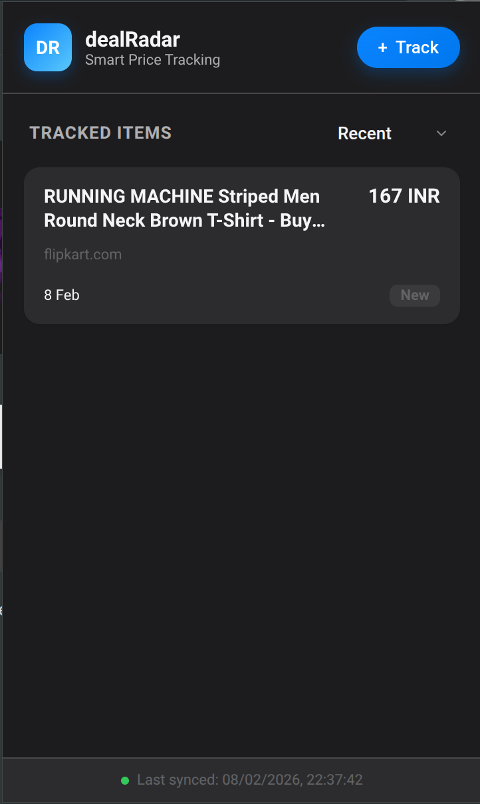
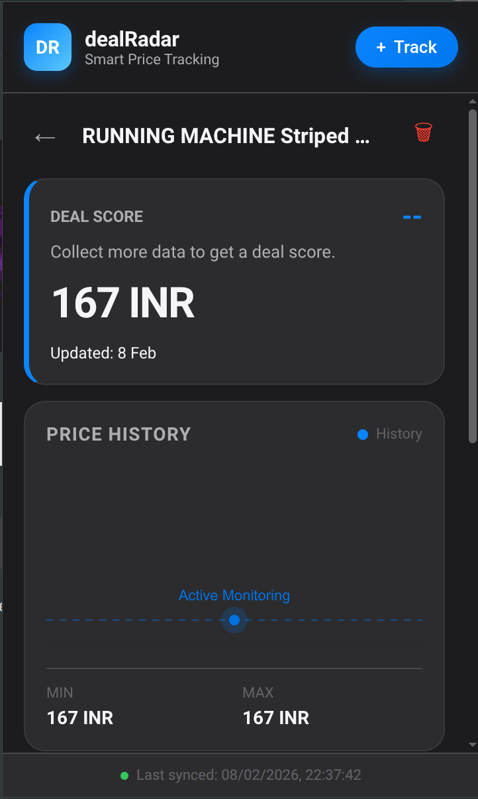

<div align="center">
  
  <h1>🎯 dealRadar</h1>
  <p>
    <strong>Smart Price Tracking Extension</strong>
    <br />
    Track product prices, view history, and get drop alerts—all locally.
    <br />
    <br />
    <a href="https://addons.mozilla.org/addon/dealradar/">Install for Firefox</a>
    ·
    <a href="#installation">Install for Chrome</a>
  </p>
  
  [](https://addons.mozilla.org/addon/dealradar/)
</div>

## Table of Contents

- [About The Project](#about-the-project)
- [Key Features](#key-features)
- [Built With](#built-with)
- [Installation](#installation)
- [Usage](#usage)
- [Project Structure](#project-structure)
- [Contributing](#contributing)

---

<a id="about-the-project"></a>
## 📖 About The Project

**dealRadar** is a powerful, privacy-focused Chrome and Firefox extension designed to help you track product prices across any e-commerce website. 

Unlike other price trackers that rely on external servers or require user accounts, **dealRadar** works entirely **locally** on your device. It uses intelligent heuristics to detect price, currency, and product details, making it universally compatible with sites like Amazon, Flipkart, and more.

With a modern, Apple-inspired interface, it provides:
*   **Instant Price History**: Visualize price trends with interactive charts.
*   **Smart Deal Scoring**: Know if a price is "Great", "Good", or "High" instantly.
*   **Custom Alerts**: Set target prices or percentage drops.

<div align="center">
  
  
</div>

<a id="built-with"></a>
### 🏗 Built With

*   
*   
*   
*   **Chrome Storage API**: For local data persistence.
*   **Chrome Alarms API**: For periodic background checks.

---

<a id="key-features"></a>
## ✨ Key Features

### 🚀 Smart Tracking
*   **Universal Compatibility**: Works on almost any product page (Amazon, Flipkart, Myntra, etc.) using intelligent DOM analysis.
*   **One-Click Add**: Simply click "Track" on the popup to start monitoring a product instantly.

### 📊 Visual Price History
*   **Interactive Charts**: Hover over beautiful gradient charts to see exact price points and dates.
*   **Instant Stats**: View Min, Max, and Current prices at a glance.
*   **Deal Score**: Algorithms analyze the current price against the average to rate the deal quality (Good, Great, Bad).

### 🔔 Robust Alerts
*   **Custom Targets**: Set specific price goals or percentage drop thresholds (e.g., "Notify me at -10%").
*   **Smart Notifications**: Get native browser notifications when prices drop.
*   **Background Monitoring**: Quietly checks prices in the background periodically without affecting browser performance.

---

<a id="installation"></a>
## 🛠 Installation

### 🦊 Firefox
1.  Visit the [dealRadar Add-on page](https://addons.mozilla.org/addon/dealradar/).
2.  Click **"Add to Firefox"**.

### ⚪ Chrome (Manual Install)
Since this extension is not yet on the Chrome Web Store, you can install it manually:

1.  **Clone or Download** this repository.
2.  Open Chrome and navigate to `chrome://extensions/`.
3.  Enable **Developer mode** (toggle in the top right corner).
4.  Click **Load unpacked**.
5.  Select the **`dealRadar`** folder (ensure it contains the `manifest.json` file).

---

<a id="usage"></a>
## 🚀 Usage

1.  **Navigate to a Product Page**: Go to any product page on an e-commerce site.
2.  **Open dealRadar**: Click the dealRadar icon in your browser toolbar.
3.  **Click "Track Price"**: The extension will scrape the current price and add it to your watchlist.
4.  **View Dashboard**: Click the icon again to see your tracked items, price history charts, and stats.
5.  **Set Alerts**: Click the verify/edit icon next to an item to set a target price.

---

<a id="project-structure"></a>
## 📂 Project Structure

This project is organized for modularity and maintainability:

```text
dealRadar/
├── manifest.json        # Extension configuration (Manifest V3)
├── README.md            # Project Documentation
├── assets/              # Static assets (screenshots)
└── src/
    ├── background/      # Service worker for background tasks
    │   └── service-worker.js
    ├── content/         # Content scripts for scrapping & price extraction
    │   └── content.js
    ├── popup/           # Popup UI and Logic
    │   ├── popup.html   # Main popup structure
    │   ├── popup.css    # Modern CSS variables & styles
    │   ├── popup.js     # Main entry point & event listeners
    │   ├── ui.js        # UI rendering & DOM manipulation
    │   ├── chart.js     # Canvas chart rendering logic
    │   └── storage.js   # Local storage management wrapper
    └── utils/           # Shared utilities
        └── format.js    # Currency formatting & helpers
```

---

<a id="contributing"></a>
## 🤝 Contributing

Any contributions you make are **greatly appreciated**.

1.  Fork the Project
2.  Create your Feature Branch (`git checkout -b feature/AmazingFeature`)
3.  Commit your Changes (`git commit -m 'Add some AmazingFeature'`)
4.  Push to the Branch (`git push origin feature/AmazingFeature`)
5.  Open a Pull Request

---

